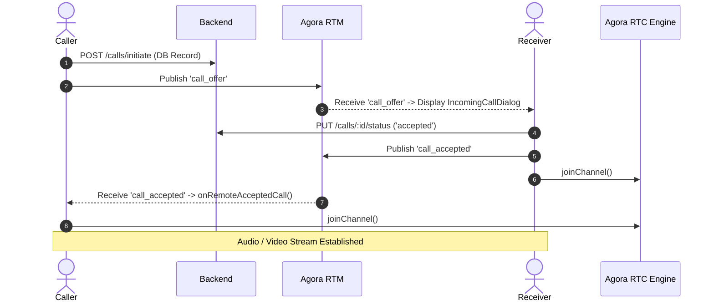

# 🚀 Complete Implementation & Setup Documentation
## Agora RTC + RTM Audio/Video Calling & Chat App (Flutter)

---

## 📌 Executive Summary

This application is built with **Flutter**, **Agora RTC Engine (v6.5.4)**, **Agora RTM SDK (v2.2.5)**, and **GetX State Management**. 

It uses a **100% pure event-driven architecture** for all real-time communication (calls, chats, and notification dots) with **zero periodic REST API polling timers**.

---

## 🛠️ 1. Infrastructure & Backend Configuration

### **Agora Console Project Requirements**
- **Agora App ID**: Configured in `.env` (`AGORA_APP_ID`).
- **Primary Certificate Security**: Enabled in Agora Console.
- **RTM & RTC Token Service**: Backend token generation endpoint required (`/api/v1/agora/rtm-token`).

### **Backend Token Flow**
1. When user logs in, `AuthController` initializes `RtmService`.
2. `RtmService.initAndLoginUser(userId)` calls `POST /api/v1/agora/rtm-token` with `{ "user_account": "<user_id>" }` and HTTP Bearer Token authentication.
3. Backend returns a valid Agora RTM Token.
4. `RtmService` logs into Agora RTM with the fetched token and subscribes to channel `'user_<userId>'`.

---

## 🏗️ 2. Core Architecture & Services

### **A. `RtmService` (Real-Time Messaging Manager)**
- **File**: [`lib/core/services/rtm_service/rtm_service.dart`](file:///Users/labib/Desktop/Fahim_Workspace/agorartcapptest/lib/core/services/rtm_service/rtm_service.dart)
- **Role**: Manages Agora RTM lifecycle, user login/logout, listening for incoming event payloads, and publishing peer messages.
- **Key Mechanics**:
  - **Binary Payload Decoding**: Deserializes raw binary byte payloads (`Uint8List`) into text JSON using `utf8.decode()`.
  - **Dual Target Publishing**: Publishes events to both:
    1. Direct User Account ID (`peerUserId`) via `RtmChannelType.user`.
    2. Subscribed Channel (`'user_$peerUserId'`) via `RtmChannelType.message`.

#### **Supported Event Payloads (`type`)**:
| Event Type | Trigger | Result |
| :--- | :--- | :--- |
| `call_offer` | Caller initiates call | Receiver receives offer & pops `IncomingCallDialog` |
| `call_accepted` | Receiver accepts call | Caller joins Agora RTC channel & opens active call screen |
| `call_rejected` | Receiver rejects call | Caller closes outgoing call screen |
| `call_ended` | Either party ends call | Both parties leave RTC channel & close call screens |
| `chat_message` | Peer sends message | Receiver refreshes active chat & updates unread badge |

---

### **B. `CallController` (Audio & Video Calling Manager)**
- **File**: [`lib/features/call/controllers/call_controller.dart`](file:///Users/labib/Desktop/Fahim_Workspace/agorartcapptest/lib/features/call/controllers/call_controller.dart)
- **Role**: Handles RTC channel creation, microphone/camera permission validation, token retrieval, in-call diagnostics, and native Agora RTC event callbacks.

#### **Calling Sequence**:


#### **Native RTC Callbacks**:
- `onJoinChannelSuccess`: Starts duration timer and enables speakerphone.
- `onUserJoined`: Subscribes to remote audio/video stream.
- `onUserOffline`: Automatically cleans up resources and closes call screens.

---

### **C. Chat & Notification Controllers**
- **`ChatController`**: [`lib/features/chat/controllers/chat_controller.dart`](file:///Users/labib/Desktop/Fahim_Workspace/agorartcapptest/lib/features/chat/controllers/chat_controller.dart)
  - Fetches message history once on screen open.
  - Broadcasts new messages via RTM (`sendPeerMessage`) upon sending.
  - Updates chat history dynamically when an RTM `chat_message` event is received.
- **`NotificationController`**: [`lib/features/notification/controllers/notification_controller.dart`](file:///Users/labib/Desktop/Fahim_Workspace/agorartcapptest/lib/features/notification/controllers/notification_controller.dart)
  - Manages unread notification badge state.
  - Dynamic updates triggered live via incoming RTM events.

---

## 📱 3. UI Screen Components & Layouts

1. **User List Screen**: [`lib/features/user_list/screens/user_list_screen.dart`](file:///Users/labib/Desktop/Fahim_Workspace/agorartcapptest/lib/features/user_list/screens/user_list_screen.dart)
   - Displays list of online users with audio/video call buttons and direct chat navigation.
   - Shows top app bar unread notification badge.
2. **Outgoing Call Screen**: [`lib/features/call/screens/outgoing_call_screen.dart`](file:///Users/labib/Desktop/Fahim_Workspace/agorartcapptest/lib/features/call/screens/outgoing_call_screen.dart)
   - Fully centered layout featuring a pulsing animated avatar, call type display, and cancel button.
3. **Active Call Screens**:
   - **Audio**: [`lib/features/call/screens/active_audio_call_screen.dart`](file:///Users/labib/Desktop/Fahim_Workspace/agorartcapptest/lib/features/call/screens/active_audio_call_screen.dart) (Mute, Speaker, Duration Timer, In-App Logs).
   - **Video**: [`lib/features/call/screens/active_video_call_screen.dart`](file:///Users/labib/Desktop/Fahim_Workspace/agorartcapptest/lib/features/call/screens/active_video_call_screen.dart) (Local & Remote Video Renderers, Camera Toggle/Switch).

---

## ⚙️ 4. Setup & Build Guide

### **A. Prerequisites**
- Flutter SDK `^3.22.0`
- Android NDK `27.0.12077973` or compatible
- Android Gradle Plugin with 64-bit ABI filter support

### **B. Configuration Files**
1. **`.env`**:
   ```env
   API_BASE_URL=https://agotartctestserver.onrender.com/api/v1
   AGORA_APP_ID=<YOUR_AGORA_APP_ID>
   ```

2. **`android/app/build.gradle.kts`**:
   ```kotlin
   defaultConfig {
       minSdk = 24
       targetSdk = 35
       ndk {
           abiFilters.addAll(listOf("arm64-v8a", "x86_64"))
       }
   }
   ```

3. **Android Permissions (`AndroidManifest.xml`)**:
   ```xml
   <uses-permission android:name="android.permission.INTERNET" />
   <uses-permission android:name="android.permission.RECORD_AUDIO" />
   <uses-permission android:name="android.permission.CAMERA" />
   <uses-permission android:name="android.permission.MODIFY_AUDIO_SETTINGS" />
   <uses-permission android:name="android.permission.ACCESS_NETWORK_STATE" />
   ```

### **C. Build & Run Commands**
```bash
# 1. Fetch dependencies
flutter pub get

# 2. Clean build cache
flutter clean

# 3. Analyze code for issues
flutter analyze

# 4. Run application
flutter run
```
