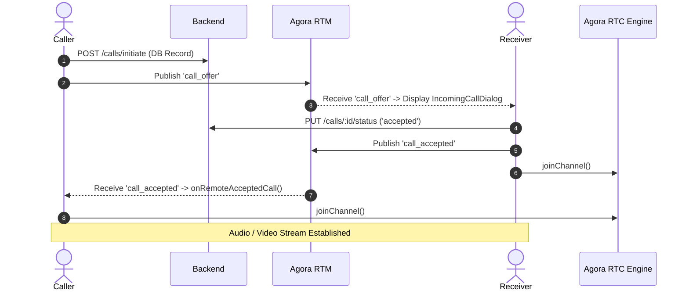

# 🚀 Complete Implementation & Setup Documentation
## Agora RTC + RTM Audio/Video Calling & Chat App (Flutter)

---

## 📌 Executive Summary

This application is built with **Flutter**, **Agora RTC Engine (v6.5.4)**, **Agora RTM SDK (v2.2.5)**, and **GetX State Management**. 

It uses a **100% pure event-driven architecture** for all real-time communication (calls, chats, and notification dots) with **zero periodic REST API polling timers**.

---

## 🛠️ 1. Complete Agora Console & Backend Token Setup Guide

### **Step 1: Agora Developer Console Setup**
1. Go to [Agora Console](https://console.agora.io/) and log in (or register a free account).
2. Navigate to **Project Management** > **Create a Project**.
3. Enter your **Project Name** (e.g., `AgoraRtcAppTest`).
4. Select **Secured mode: APP ID + Token** (Recommended for production and required for RTM).
5. Copy the generated **App ID** and paste it into your `.env` file:
   ```env
   AGORA_APP_ID=5d14aebdcf754f92a51247ee5f0bfed0
   ```

### **Step 2: Enable App Certificate (Token Security)**
1. In Agora Console under **Project Management**, locate your project and click **Edit / Project Details**.
2. Under **Security**, click **Enable Primary Certificate**.
3. Copy your **Primary Certificate** (Keep this private on your backend server only; NEVER hardcode in client mobile apps).

### **Step 3: Enable Agora RTM (Real-Time Messaging)**
1. In the left navigation bar of Agora Console, go to **Extension Center** > **Real-Time Messaging (RTM)**.
2. Select your project and click **Enable RTM**.

---

### **Step 4: Backend RTM/RTC Token Server Setup**
Because App Certificate security is enabled, clients cannot connect with an empty token. The backend server must generate dynamic tokens using Agora's server SDK (`agora-access-token` for Node.js/Python/Go).

#### **Required Backend Endpoint**:
- **URL**: `POST /api/v1/agora/rtm-token`
- **Headers**:
  ```http
  Authorization: Bearer <user_access_token>
  Content-Type: application/json
  ```
- **Request Body**:
  ```json
  {
    "user_account": "1"
  }
  ```
- **Expected Response**:
  ```json
  {
    "app_id": "5d14aebdcf754f92a51247ee5f0bfed0",
    "user_account": "1",
    "token": "0065d14aebdcf754f92a51247ee5f0bfed0IADArSTZxd48M..."
  }
  ```

#### **How Backend Token Generation Works (Server-Side Logic)**:
```python
# Example Python Backend snippet using RtmTokenBuilder2
from agora_token_builder import RtmTokenBuilder, Role_RtmUser
import time

app_id = "5d14aebdcf754f92a51247ee5f0bfed0"
app_certificate = "YOUR_BACKEND_APP_CERTIFICATE"
user_account = "1" # User ID string
expiration_in_seconds = 3600 * 24 # 24 hours

token = RtmTokenBuilder.buildToken(
    app_id,
    app_certificate,
    user_account,
    Role_RtmUser,
    int(time.time()) + expiration_in_seconds
)
```

---

## 📱 1.1 Flutter-Side Agora Setup & Code Implementation Guide

### **Step 1: Dependencies (`pubspec.yaml`)**
```yaml
dependencies:
  flutter:
    sdk: flutter
  agora_rtc_engine: ^6.5.4
  agora_rtm: ^2.2.5
  flutter_dotenv: ^5.2.1
  permission_handler: ^11.4.0
  get: ^4.6.6
```

---

### **Step 2: Environment Setup (`main.dart`)**
Load `.env` variables before running the application:
```dart
void main() async {
  WidgetsFlutterBinding.ensureInitialized();
  await dotenv.load(fileName: ".env");
  
  // Register Services
  Get.put(RtmService());
  Get.put(CallController());
  
  runApp(const MyApp());
}
```

---

### **Step 3: Flutter Agora RTM Implementation (`RtmService`)**

#### **1. Initialize & Log into RTM**:
```dart
final (status, client) = await RTM(appId, userId);
_rtmClient = client;

// Register RTM Event Listeners
_rtmClient?.addListener(
  message: (MessageEvent event) {
    final String rawMsg = _parseMessageContent(event.message);
    final String peerId = event.publisher?.toString() ?? '';
    _handleIncomingRtmMessage(rawMsg, peerId);
  },
  linkState: (LinkStateEvent event) {
    debugPrint('RTM Link State: ${event.currentState}');
  },
);

// Login to RTM with backend token
final (loginStatus, loginRes) = await _rtmClient!.login(token);

// Subscribe to User Channel
await _rtmClient?.subscribe('user_$userId');
```

#### **2. Binary Byte Payload Decoding**:
```dart
String _parseMessageContent(dynamic msg) {
  if (msg == null) return '';
  if (msg is String) return msg;
  if (msg is List<int> || msg is Uint8List) {
    try {
      return utf8.decode(msg as List<int>);
    } catch (_) {
      return String.fromCharCodes(msg as List<int>);
    }
  }
  return msg.toString();
}
```

#### **3. Publish Real-time Signaling Payload**:
```dart
Future<void> sendPeerMessage({
  required String peerUserId,
  required Map<String, dynamic> payload,
}) async {
  final jsonString = jsonEncode(payload);

  // Send Direct User Peer Message
  await _rtmClient?.publish(
    peerUserId,
    jsonString,
    channelType: RtmChannelType.user,
  );

  // Send Message Channel Event
  await _rtmClient?.publish(
    'user_$peerUserId',
    jsonString,
    channelType: RtmChannelType.message,
  );
}
```

---

### **Step 4: Flutter Agora RTC Implementation (`CallController`)**

#### **1. Request Permissions & Initialize Engine**:
```dart
// Request Camera & Microphone Permissions
await [Permission.microphone, Permission.camera].request();

// Create & Initialize Engine
rtcEngine = createAgoraRtcEngine();
await rtcEngine!.initialize(RtcEngineContext(
  appId: agoraAppId,
  channelProfile: ChannelProfileType.channelProfileCommunication,
));

// Register RTC Event Handlers
rtcEngine!.registerEventHandler(RtcEngineEventHandler(
  onJoinChannelSuccess: (RtcConnection connection, int elapsed) {
    debugPrint('Joined RTC Channel: ${connection.channelId}');
  },
  onUserJoined: (RtcConnection connection, int remoteUid, int elapsed) {
    debugPrint('Remote User Joined: $remoteUid');
    this.remoteUid.value = remoteUid;
  },
  onUserOffline: (RtcConnection connection, int remoteUid, UserOfflineReasonType reason) {
    endCall();
  },
));
```

#### **2. Enable Streams & Join Channel**:
```dart
await rtcEngine!.enableAudio();
if (callType == 'video') {
  await rtcEngine!.enableVideo();
  await rtcEngine!.startPreview();
}

await rtcEngine!.joinChannel(
  token: rtcToken,
  channelId: channelName,
  uid: userId,
  options: ChannelMediaOptions(
    channelProfile: ChannelProfileType.channelProfileCommunication,
    publishCameraTrack: callType == 'video',
    publishMicrophoneTrack: true,
    autoSubscribeAudio: true,
    autoSubscribeVideo: callType == 'video',
  ),
);
```

#### **3. Render Video Canvas**:
```dart
// Local Video View
AgoraVideoView(
  controller: VideoViewController(
    rtcEngine: controller.rtcEngine!,
    canvas: const VideoCanvas(uid: 0),
  ),
)

// Remote Video View
AgoraVideoView(
  controller: VideoViewController.remote(
    rtcEngine: controller.rtcEngine!,
    canvas: VideoCanvas(uid: controller.remoteUid.value),
    connection: RtcConnection(channelId: controller.activeCall.value!.channelName),
  ),
)
```

---

## 💻 1.2 Complete Coding Implementation & Controller Blueprints

### **1. `RtmService` (Full Production Code)**
File: [`lib/core/services/rtm_service/rtm_service.dart`](lib/core/services/rtm_service/rtm_service.dart)

```dart
import 'dart:convert';
import 'package:flutter/foundation.dart';
import 'package:agora_rtm/agora_rtm.dart';
import 'package:get/get.dart';
import 'package:agorartcapptest/core/api_endpoint/api_endpoint.dart';
import 'package:agorartcapptest/core/services/network_service/network_service.dart';
import 'package:agorartcapptest/features/call/controllers/call_controller.dart';
import 'package:agorartcapptest/features/call/models/call_model.dart';
import 'package:agorartcapptest/features/call/screens/incoming_call_dialog.dart';
import 'package:agorartcapptest/features/chat/controllers/chat_controller.dart';
import 'package:agorartcapptest/features/notification/controllers/notification_controller.dart';

class RtmService extends GetxService {
  final NetworkService _networkService = NetworkService();
  RtmClient? _rtmClient;
  bool _isLoggedIn = false;
  String _currentUserId = '';

  bool get isLoggedIn => _isLoggedIn;

  String _parseMessageContent(dynamic msg) {
    if (msg == null) return '';
    if (msg is String) return msg;
    if (msg is List<int> || msg is Uint8List) {
      try {
        return utf8.decode(msg as List<int>);
      } catch (_) {
        return String.fromCharCodes(msg as List<int>);
      }
    }
    return msg.toString();
  }

  Future<void> initAndLoginUser(String userId) async {
    if (userId.isEmpty || userId == '0') return;
    if (_isLoggedIn && _currentUserId == userId) return;

    _currentUserId = userId;

    try {
      final response = await _networkService.post(
        ApiEndpoint.getRtmToken,
        body: {'user_account': userId},
      );

      if (response.statusCode == 200) {
        final data = jsonDecode(response.body);
        final String token = data['token']?.toString() ?? '';
        final String appId = data['app_id']?.toString() ?? ApiEndpoint.agoraAppId;

        if (token.isNotEmpty) {
          await initAndLogin(appId: appId, userId: userId, token: token);
        }
      }
    } catch (e) {
      debugPrint('RTM Token Error: $e');
    }
  }

  Future<void> initAndLogin({
    required String appId,
    required String userId,
    required String token,
  }) async {
    if (_isLoggedIn && _currentUserId == userId) return;
    _currentUserId = userId;

    try {
      if (_rtmClient != null) {
        try {
          await _rtmClient?.logout();
          await _rtmClient?.release();
        } catch (_) {}
        _rtmClient = null;
        _isLoggedIn = false;
      }

      final (status, client) = await RTM(appId, userId);
      _rtmClient = client;

      // Event Listeners
      _rtmClient?.addListener(
        message: (MessageEvent event) {
          final String rawMsg = _parseMessageContent(event.message);
          final String peerId = event.publisher?.toString() ?? '';
          _handleIncomingRtmMessage(rawMsg, peerId);
        },
        linkState: (LinkStateEvent event) {
          if (event.currentState == RtmLinkState.failed ||
              event.currentState == RtmLinkState.disconnected) {
            _isLoggedIn = false;
          }
        },
      );

      final (loginStatus, loginRes) = await _rtmClient!.login(token);
      if (loginStatus.error) {
        _isLoggedIn = false;
        return;
      }

      await _rtmClient?.subscribe('user_$userId');
      _isLoggedIn = true;
    } catch (e) {
      _isLoggedIn = false;
    }
  }

  void _handleIncomingRtmMessage(String rawMsg, String peerId) {
    if (rawMsg.isEmpty) return;

    try {
      final Map<String, dynamic> data = jsonDecode(rawMsg);
      final String type = data['type']?.toString() ?? '';

      if (type == 'call_offer') {
        _handleCallOffer(data);
      } else if (type == 'call_accepted') {
        _handleCallAccepted(data);
      } else if (type == 'call_rejected' || type == 'call_ended') {
        _handleCallEnded();
      }

      if (Get.isRegistered<NotificationController>()) {
        Get.find<NotificationController>().fetchNotifications(showLoading: false);
      }

      if (Get.isRegistered<ChatController>()) {
        Get.find<ChatController>().fetchMessages(showLoading: false);
      }
    } catch (e) {
      debugPrint('Error parsing RTM message: $e');
    }
  }

  void _handleCallOffer(Map<String, dynamic> data) {
    final callModel = CallModel(
      id: data['call_id'] as int? ?? 0,
      callerId: data['caller_id'] as int? ?? 0,
      callerUsername: data['caller_username']?.toString() ?? 'Caller',
      receiverId: data['receiver_id'] as int? ?? 0,
      receiverUsername: '',
      channelName: data['channel_name']?.toString() ?? '',
      callType: data['call_type']?.toString() ?? 'audio',
      status: 'initiated',
      durationSeconds: 0,
      receiverRtcToken: data['rtc_token']?.toString(),
      agoraAppId: data['agora_app_id']?.toString() ?? ApiEndpoint.agoraAppId,
    );

    if (Get.isDialogOpen != true) {
      Get.dialog(
        IncomingCallDialog(callData: callModel),
        barrierDismissible: false,
      );
    }
  }

  void _handleCallAccepted(Map<String, dynamic> data) {
    if (Get.isRegistered<CallController>()) {
      Get.find<CallController>().onRemoteAcceptedCall();
    }
  }

  void _handleCallEnded() {
    if (Get.isRegistered<CallController>()) {
      Get.find<CallController>().endCall();
    }
  }

  Future<void> sendPeerMessage({
    required String peerUserId,
    required Map<String, dynamic> payload,
  }) async {
    if (_rtmClient == null || !_isLoggedIn) return;
    try {
      final jsonString = jsonEncode(payload);

      await _rtmClient?.publish(
        peerUserId,
        jsonString,
        channelType: RtmChannelType.user,
      );

      await _rtmClient?.publish(
        'user_$peerUserId',
        jsonString,
        channelType: RtmChannelType.message,
      );
    } catch (e) {
      debugPrint('Send Peer Message Error: $e');
    }
  }
}
```

---

### **2. `CallController` (Full Calling Logic Blueprint)**
File: [`lib/features/call/controllers/call_controller.dart`](lib/features/call/controllers/call_controller.dart)

```dart
class CallController extends GetxController {
  RtcEngine? rtcEngine;
  final Rxn<CallModel> activeCall = Rxn<CallModel>();
  final RxnInt remoteUid = RxnInt();

  final RxBool isMuted = false.obs;
  final RxBool isVideoDisabled = false.obs;
  final RxBool isFrontCamera = true.obs;
  final RxBool isSpeakerOn = true.obs;
  final RxInt callDurationSeconds = 0.obs;

  // 1. Initiate Call
  Future<void> initiateCall(int receiverId, String callType) async {
    final callModel = await _callService.initiateCall(receiverId, callType);
    activeCall.value = callModel;

    // Send RTM Call Offer
    Get.find<RtmService>().sendPeerMessage(
      peerUserId: receiverId.toString(),
      payload: {
        'type': 'call_offer',
        'call_id': callModel.id,
        'caller_id': callModel.callerId,
        'caller_username': callModel.callerUsername,
        'receiver_id': callModel.receiverId,
        'channel_name': callModel.channelName,
        'call_type': callModel.callType,
        'rtc_token': callModel.receiverRtcToken,
        'agora_app_id': callModel.agoraAppId ?? ApiEndpoint.agoraAppId,
      },
    );

    Get.toNamed(AppRoutes.outgoingCallScreen);
  }

  // 2. Accept Call
  Future<void> acceptCall(CallModel callData) async {
    activeCall.value = callData;

    await _callService.updateCallStatus(callData.id, 'accepted');

    // Notify Caller via RTM
    Get.find<RtmService>().sendPeerMessage(
      peerUserId: callData.callerId.toString(),
      payload: {'type': 'call_accepted', 'call_id': callData.id},
    );

    await _joinAgoraChannel(
      agoraAppId: callData.agoraAppId ?? ApiEndpoint.agoraAppId,
      channelName: callData.channelName,
      token: callData.receiverRtcToken ?? '',
      uid: callData.receiverId,
      callType: callData.callType,
    );

    Get.toNamed(callData.callType == 'video'
        ? AppRoutes.activeVideoCallScreen
        : AppRoutes.activeAudioCallScreen);
  }

  // 3. Caller Remote Accepted Handler
  Future<void> onRemoteAcceptedCall() async {
    final currentCall = activeCall.value;
    if (currentCall != null) {
      await _joinAgoraChannel(
        agoraAppId: currentCall.agoraAppId ?? ApiEndpoint.agoraAppId,
        channelName: currentCall.channelName,
        token: currentCall.callerRtcToken ?? '',
        uid: currentCall.callerId,
        callType: currentCall.callType,
      );

      Get.offNamed(currentCall.callType == 'video'
          ? AppRoutes.activeVideoCallScreen
          : AppRoutes.activeAudioCallScreen);
    }
  }

  // In-Call Controls
  void toggleMute() {
    isMuted.value = !isMuted.value;
    rtcEngine?.muteLocalAudioStream(isMuted.value);
  }

  void toggleCamera() {
    isVideoDisabled.value = !isVideoDisabled.value;
    rtcEngine?.muteLocalVideoStream(isVideoDisabled.value);
  }

  void switchCamera() {
    isFrontCamera.value = !isFrontCamera.value;
    rtcEngine?.switchCamera();
  }

  void toggleSpeaker() {
    isSpeakerOn.value = !isSpeakerOn.value;
    rtcEngine?.setEnableSpeakerphone(isSpeakerOn.value);
  }
}
```

---

## 🏗️ 2. Core Architecture & Services

### **A. `RtmService` (Real-Time Messaging Manager)**
- **File**: [`lib/core/services/rtm_service/rtm_service.dart`](lib/core/services/rtm_service/rtm_service.dart)
- **Role**: Manages Agora RTM lifecycle, user login/logout, listening for incoming event payloads, and publishing peer messages.
- **Key Mechanics**:
  - **Binary Payload Decoding**: Deserializes raw binary byte payloads (`Uint8List`) into text JSON using `utf8.decode()`.
  - **Dual Target Publishing**: Publishes events to both:
    1. Direct User Account ID (`peerUserId`) via `RtmChannelType.user`.
    2. Subscribed Channel (`'user_$peerUserId'`) via `RtmChannelType.message`.

#### **Supported Event Payloads (`type`)**:
| Event Type | Trigger | Result |
| :--- | :--- | :--- |
| `call_offer` | Caller initiates call | Receiver receives offer & pops `IncomingCallDialog` |
| `call_accepted` | Receiver accepts call | Caller joins Agora RTC channel & opens active call screen |
| `call_rejected` | Receiver rejects call | Caller closes outgoing call screen |
| `call_ended` | Either party ends call | Both parties leave RTC channel & close call screens |
| `chat_message` | Peer sends message | Receiver refreshes active chat & updates unread badge |

---

### **B. `CallController` (Audio & Video Calling Manager)**
- **File**: [`lib/features/call/controllers/call_controller.dart`](lib/features/call/controllers/call_controller.dart)
- **Role**: Handles RTC channel creation, microphone/camera permission validation, token retrieval, in-call diagnostics, and native Agora RTC event callbacks.

#### **Calling Sequence**:


#### **Native RTC Callbacks**:
- `onJoinChannelSuccess`: Starts duration timer and enables speakerphone.
- `onUserJoined`: Subscribes to remote audio/video stream.
- `onUserOffline`: Automatically cleans up resources and closes call screens.

---

### **C. Chat & Notification Controllers**
- **`ChatController`**: [`lib/features/chat/controllers/chat_controller.dart`](lib/features/chat/controllers/chat_controller.dart)
  - Fetches message history once on screen open.
  - Broadcasts new messages via RTM (`sendPeerMessage`) upon sending.
  - Updates chat history dynamically when an RTM `chat_message` event is received.
- **`NotificationController`**: [`lib/features/notification/controllers/notification_controller.dart`](lib/features/notification/controllers/notification_controller.dart)
  - Manages unread notification badge state.
  - Dynamic updates triggered live via incoming RTM events.

---

## 📱 3. UI Screen Components & Layouts

1. **User List Screen**: [`lib/features/user_list/screens/user_list_screen.dart`](lib/features/user_list/screens/user_list_screen.dart)
   - Displays list of online users with audio/video call buttons and direct chat navigation.
   - Shows top app bar unread notification badge.
2. **Outgoing Call Screen**: [`lib/features/call/screens/outgoing_call_screen.dart`](lib/features/call/screens/outgoing_call_screen.dart)
   - Fully centered layout featuring a pulsing animated avatar, call type display, and cancel button.
3. **Active Call Screens**:
   - **Audio**: [`lib/features/call/screens/active_audio_call_screen.dart`](lib/features/call/screens/active_audio_call_screen.dart) (Mute, Speaker, Duration Timer, In-App Logs).
   - **Video**: [`lib/features/call/screens/active_video_call_screen.dart`](lib/features/call/screens/active_video_call_screen.dart) (Local & Remote Video Renderers, Camera Toggle/Switch).

---

## ⚙️ 4. Setup & Build Guide

### **A. Prerequisites**
- Flutter SDK `^3.22.0`
- Android NDK `27.0.12077973` or compatible
- Android Gradle Plugin with 64-bit ABI filter support

### **B. Configuration Files**
1. **`.env`**:
   ```env
   API_BASE_URL=https://agotartctestserver.onrender.com/api/v1
   AGORA_APP_ID=<YOUR_AGORA_APP_ID>
   ```

2. **`android/app/build.gradle.kts`**:
   ```kotlin
   defaultConfig {
       minSdk = 24
       targetSdk = 35
       ndk {
           abiFilters.addAll(listOf("arm64-v8a", "x86_64"))
       }
   }
   ```

3. **Android Permissions (`AndroidManifest.xml`)**:
   ```xml
   <uses-permission android:name="android.permission.INTERNET" />
   <uses-permission android:name="android.permission.RECORD_AUDIO" />
   <uses-permission android:name="android.permission.CAMERA" />
   <uses-permission android:name="android.permission.MODIFY_AUDIO_SETTINGS" />
   <uses-permission android:name="android.permission.ACCESS_NETWORK_STATE" />
   ```

### **C. Build & Run Commands**
```bash
# 1. Fetch dependencies
flutter pub get

# 2. Clean build cache
flutter clean

# 3. Analyze code for issues
flutter analyze

# 4. Run application
flutter run
```
